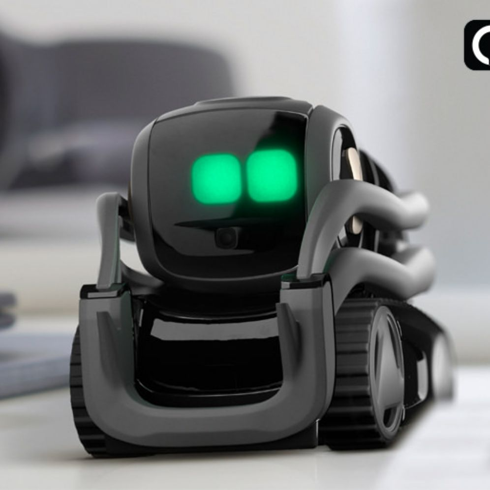

  
  
  <h1>ColdStorage Service</h1>
  
Distributed software system for an _**autonomous forklift robot**_. The project had been developed for the course of [Software Systems Engineering M](https://www.unibo.it/en/teaching/course-unit-catalogue/course-unit/2023/468003) of the University of Bologna, using the [SCRUM agile framework](https://www.scrum.org/resources/what-is-scrum).
  

### Components
<table>
  <tr align="center">
    <th width="15%">Name</th>
    <th width="35%">Description</th>
    <th width="50%">Demo</th>
  </tr>
  <tr align="center">
    <td><b>Virtual&nbsp;Robot</b></td>
    <td>
      Web application that simulates a Robot. The robot is confined in a <b>virtual environment</b> (a rectangular room) and can <b>receive commands to perform some actions</b>, such as moving forward/backwards for a certain amount of time and to rotate.
    </td>
    <td></td>
  </tr>
  <tr align="center">
    <td><b>ColdStorage&nbsp;Core</b></td>
    <td>
      Main component of the system. It <b>manages the ColdStorage Service</b>. It receives Store Requests from the users, process them and delegates a <i>Transport Trolley</i> for the material pick up and deposit, in case there is enough space in the ColdRoom container.
    </td>
    <td></td>
  </tr>
  <tr align="center">
    <td><b>ColdStorage&nbsp;RaspPi</b></td>
    <td>
			Component that can run on a Raspberry Pi. It implements an <b>alarm/warning device</b>: when a ultrasonic sonar detects a distance that is lower/greater than a threshold, it sends a signal to the system, that will stop/resume the Transport Trolley activity; ColdStorage RaspPi also shows information about the system current state through a led.
	</td>
    <td></td>
  </tr>
  <tr align="center">
    <td><b>Service&nbsp;Access&nbsp;GUI</b></td>
    <td>
			Web application for the client to interact with the system and <b>send service request</b>. It allows to send a request, check the validation of the ticket received and check the current weight in the system.
		</td>
    <td></td>
  </tr>
  <tr align="center">
    <td><b>Service&nbsp;Status&nbsp;GUI</b></td>
    <td>
			Web application to <b>monitor the Service status</b>. It displays any useful information about the current state of the system, including the number of discarded requests, the weight of items stored in the system and the robot position inside of it.
		</td>
    <td></td>
  </tr>
</table>

### Roadmap
- [x] **Sprint0** - Requirements analysis and system basic structure: 
  - Latest Release (.md format): [[Cold Storage Service - Natali V3]]
  - Latest Release (html format): [Cold Storage Service - Natali V3.html](Sprint0/Codice/userDocs/Cold%20Storage%20Service%20-%20Natali%20V3.html)
  - Sprint Review: 10/11/2023
- [x] **Sprint1** - Transport Trolley + ColdStorageService: 
  - Latest Release (.md format): [[Sprint 1.0 - V3]], [[Sprint 1.1 - V3]]
  - Latest Release (html format): [Sprint 1.0 - V3.html](Sprint1.0/Codice/userDocs/Sprint%201.0%20-%20V3.html), [Sprint 1.1 - V3.html](Sprint1.1/Codice/userDocs/Sprint%201.1%20-%20V3.html)
  - Sprint Review: 17/11/2023
- [x] **Sprint2** - Led e Sonar: ✅ 2023-12-09
  - Latest Release (.md format): [[Sprint 2]]
  - Latest Release (html format): [Sprint 2.html](Sprint2/Codice/userDocs/Sprint%202.html)
  - Sprint Review: 01/12/2023
- [x] **Sprint3** - ServiceStatusGui: ✅ 2023-12-17
  - Latest Release (.md format): [[Sprint 3]]
  - Latest Release (html format): [Sprint 3.html](Sprint3/Codice/userDoc/Sprint%203.html)
  - Final Exam: 29/12/2023

## Team
<table>
  <!--<tr align="center"><td colspan="3"><b>Team BCR</b></td></tr>-->
  <tr align="center">
    <td><a href="https://github.com/LisaIU00">LisalU00</a></td>
    <td><a href="https://github.com/Lombax99">Lombax99</a></td>
    <td><a href="https://github.com/RedDuality">RedDuality</a></td>
  </tr>
    <tr align="center">
    <td></td>
    <td></td>
    <td></td>
  </tr>
  <tr align="center">
    <td><b>Lisa Uccini</b></td>
    <td><b>Luca Lombardi</b></td>
    <td><b>Giacomo Romanini</b></td>
  </tr>
</table>
